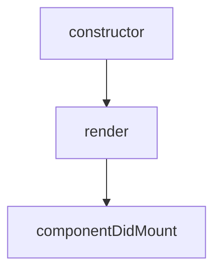
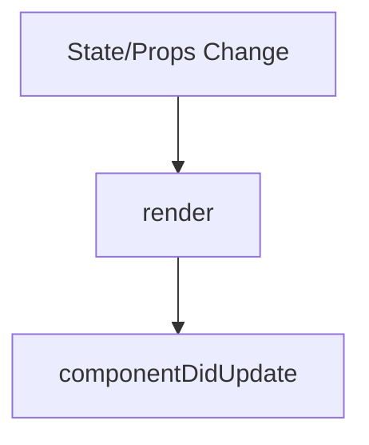
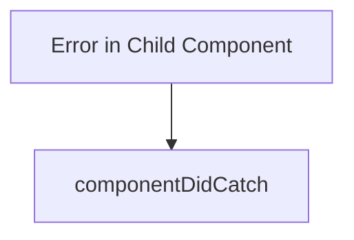

# Blog Application using React Component Lifecycle Methods

A modern React application named **blogapp** that demonstrates the practical application of React Component Lifecycle methods. It dynamically fetches post data from a REST API using the Fetch API and displays it in a clean, responsive layout.

---

## 🎯 Objective
- Understand and implement React Component Lifecycle phases.
- Use `componentDidMount()` to fetch remote data asynchronously after mounting.
- Use `componentDidCatch()` for robust error handling and boundary safety.

---

## 📖 Theoretical Overview

### 1. Component Lifecycle Phases
Every React component moves through a series of distinct phases from initialization to removal:

| Phase | Description | Key Lifecycle Hook Methods |
|:---|:---|:---|
| **Mounting** | Creating and inserting the component into the browser DOM | `constructor()`, `render()`, `componentDidMount()` |
| **Updating** | Re-rendering when props or state changes occur | `shouldComponentUpdate()`, `render()`, `componentDidUpdate()` |
| **Unmounting** | Removing the component from the browser DOM | `componentWillUnmount()` |
| **Error Handling** | Catching errors during rendering, in lifecycle methods, or in constructors | `componentDidCatch()`, `getDerivedStateFromError()` |

---

### 2. Component Execution Flow

#### Initial Mount Sequence:


#### State Update Sequence:


#### Error Handling Sequence:


---

### 3. Core Lifecycle Hook Details

> [!NOTE]
> **`componentDidMount()`** is invoked immediately after a component is inserted into the DOM. This is the recommended place for performing network requests, DOM initialization, and setting up event subscriptions.

> [!IMPORTANT]
> **`componentDidCatch(error, info)`** acts as an error boundary handler. It catches JavaScript errors anywhere in the child component tree, logs the error stack details, and prevents the entire application from crashing.

---

## 🛠️ Technologies Used
- **ReactJS 19.x** - Component-based user interface library
- **JavaScript (ES6)** - Coding language and runtime scripting
- **HTML5 & CSS3** - Structural markup and style themes
- **Fetch API** - Native browser promise-based HTTP client
- **Node.js & npm** - Dependency manager and build toolkit

---

## 📂 Project Structure

```text
blogapp
├── public
│   ├── index.html       # Entrypoint page
│   └── ...
├── src
│   ├── App.css          # Core styles
│   ├── App.js           # Root component mounting the main view
│   ├── index.css        # Global CSS stylesheet (custom premium styling)
│   ├── index.js         # Entrypoint mapping React onto index.html
│   ├── Post.js          # Post model class
│   └── Posts.js         # Posts rendering container
├── package.json         # Project metadata and dependencies
└── README.md
```

---

## 💻 Code Implementation

### 1. Post Model (`src/Post.js`)
Handles post data normalization:
```javascript
class Post {
    constructor(id, title, body) {
        this.id = id;
        this.title = title;
        this.body = body;
    }
}

export default Post;
```

### 2. Posts Component (`src/Posts.js`)
Performs API data fetching, search filtering, and maps items onto the layout:
```javascript
import React from "react";
import Post from "./Post";

class Posts extends React.Component {
    constructor(props) {
        super(props);
        this.state = {
            posts: [],
            searchQuery: ""
        };
    }

    loadPosts() {
        fetch("https://jsonplaceholder.typicode.com/posts")
            .then(response => response.json())
            .then(data => {
                const posts = data.map(
                    item => new Post(item.id, item.title, item.body)
                );
                this.setState({
                    posts: posts
                });
            });
    }

    componentDidMount() {
        this.loadPosts();
    }

    componentDidCatch(error, info) {
        alert(error);
    }

    render() {
        const filteredPosts = this.state.posts.filter(post => 
            post.title.toLowerCase().includes(this.state.searchQuery.toLowerCase()) ||
            post.body.toLowerCase().includes(this.state.searchQuery.toLowerCase())
        );

        return (
            <div className="blog-container">
                <header className="blog-header">
                    <span className="blog-badge">LATEST INSIGHTS</span>
                    <h1 className="blog-title">Premium Web Articles</h1>
                    <p className="blog-subtitle">Discover articles fetched dynamically from our REST services.</p>
                    
                    <div className="search-container">
                        <input 
                            type="text" 
                            placeholder="Search articles by title or content..." 
                            className="search-bar" 
                            value={this.state.searchQuery} 
                            onChange={(e) => this.setState({ searchQuery: e.target.value })} 
                        />
                    </div>
                </header>

                <main className="blog-grid">
                    {filteredPosts.map(post => (
                        <article key={post.id} className="blog-card">
                            <h3 className="card-title">{post.title}</h3>
                            <p className="card-body">{post.body}</p>
                        </article>
                    ))}
                </main>
            </div>
        );
    }
}

export default Posts;
```

### 3. Application Wrapper (`src/App.js`)
```javascript
import './App.css';
import Posts from './Posts';

function App() {
  return (
    <div>
      <Posts />
    </div>
  );
}

export default App;
```

---

## 🏃 How to Run the Application

### Prerequisites
Make sure you have [Node.js](https://nodejs.org/) installed.

### Steps to Execute
1. Navigate to the project root:
   ```bash
   cd blogapp
   ```
2. Install npm dependencies:
   ```bash
   npm install
   ```
3. Start the local server:
   ```bash
   npm start
   ```
4. Access the portal:
   Open your browser to `http://localhost:3000` (or the configured port if running in parallel).

---

## 📸 Output & Verification

### Browser Output
On successful boot, the component fetches JSON articles from `https://jsonplaceholder.typicode.com/posts` and renders them:


---

## 💡 Conclusion
This application successfully demonstrates the implementation of React Component Lifecycle methods. Using `componentDidMount()` ensures data is loaded asynchronously only after the DOM is fully constructed, and `componentDidCatch()` ensures robust error boundaries for child elements.
